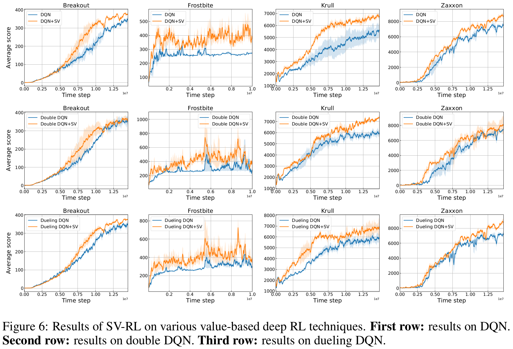
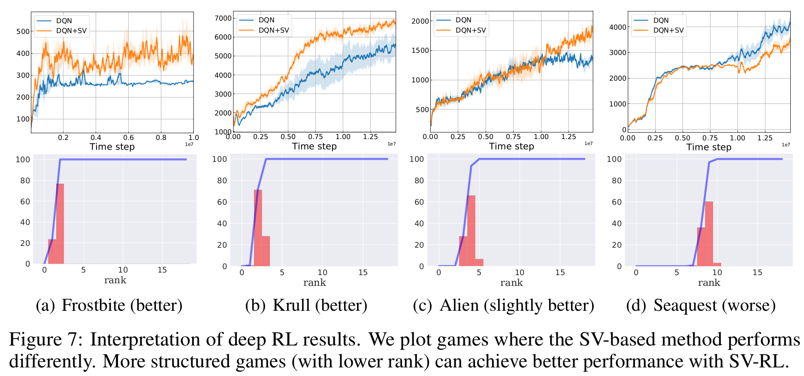

# Structured Value-based Reinforcement Learning (SV-RL)


We provide the code for the SV-RL algorithm implementation. We apply SV-RL on three
representative value-based RL techniques, including [DQN](https://www.nature.com/articles/nature14236), [Double DQN](https://arxiv.org/abs/1509.06461), and [Dueling DQN](https://arxiv.org/abs/1511.06581).


## Main Files
- [`dqn_learn.py`](dqn_learn.py): training DQN
- [`dqn_model.py`](dqn_model.py): define different network archs
- [`utils/svrl_utils.py`](utils/svrl_utils.py): define SV-RL algorithm for each SGD step


## Main Arguments
- `exp_name`: define name of current experiment.
- `--env`: choose the environment Atari games.
- `--double`: use double DQN.
- `--dueling`: use dueling DQN.
- `--svrl`: use SV-RL scheme during training.
- `--me_type`: choose which method to use for matrix estimation: `usvt` | `softimp` | `nucnorm` (default: `softimp`).
- `--maskp`: the mask probability for the sampled matrix (default: `0.9`).
- `--maskstep`: the total steps for the linear scheduler of SV-RL (default: `2e6`).
- `--num_timesteps`: the total training time steps (default: `6e7`).


## Training with SV-RL
To train a `DQN` / `Double DQN` / `Dueling DQN` model with SV-RL:
```bash
python main.py <exp_name> --env <env> --svrl --me_type <me_type>
python main.py <exp_name> --env <env> --svrl --me_type <me_type> --double
python main.py <exp_name> --env <env> --svrl --me_type <me_type> --dueling
```


## Plot Results
```bash
python plot.py <data_path1> <data_path2> \
    --legend <legend1> <legend2> \
    --save_name <save_name> \
    --title <title> \
    <optional-arguments>
```


## Representative Results

### Results across different value-based RL techniques


### Diagnosis on ranks _vs._ improvements across different games

